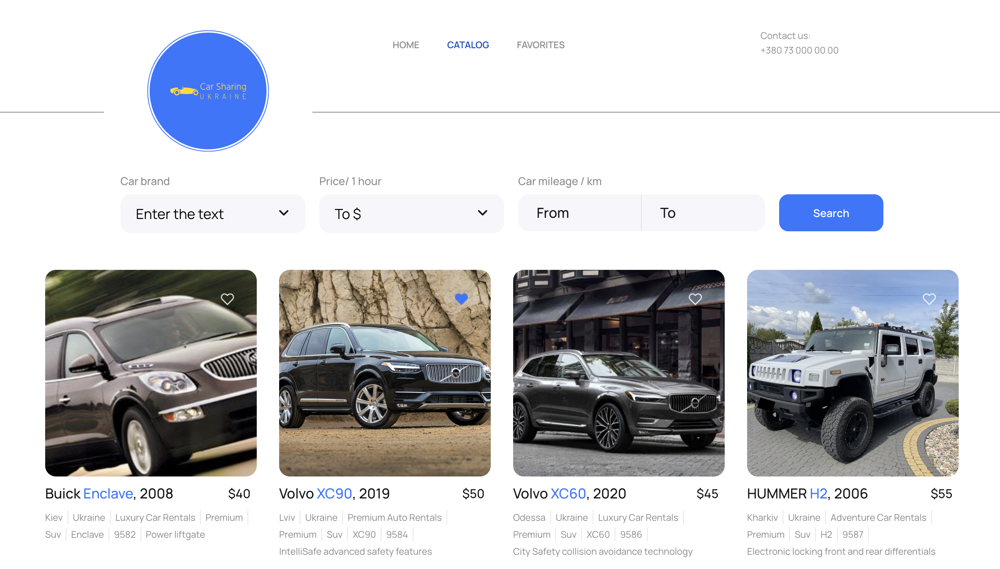

# Car Sharing Website



This project is a web application for browsing and managing car rentals. Users
can view a list of available cars, filter them, and mark their favorites.

## Table of Contents

- [Car Sharing Website](#car-sharing-website)
  - [Table of Contents](#table-of-contents)
  - [Features](#features)
  - [Technologies Used](#technologies-used)
  - [Getting Started](#getting-started)
  - [Installation](#installation)

## Features

- View a list of available cars
- Filter cars based on various criteria (e.g., brand, price)
- Mark cars as favorites
- Pagination for browsing through the car list

## Technologies Used

- React.js: JavaScript library for building user interfaces.
- Redux Toolkit: State management for React applications.
- Styled Components: Styling library for React components.
- MockAPI: Mock API for simulating backend data.

## Getting Started

To get started with this project, follow the installation instructions below.

## Installation

1. Clone the repository:
   ```bash
   git clone https://github.com/samusdimitriy/car-sharing.git
   cd car-rental-app
   ```
2. Install the dependencies:
   ```bash
   npm install
   ```
3. Start the development server:
   ```bash
   npm start
   ```
4. Open
   [https://samusdimitriy.github.io/car-sharing/](https://samusdimitriy.github.io/car-sharing/)
   to view it in the browser.

5.License This project is licensed under the MIT License - see the LICENSE file
for details.
